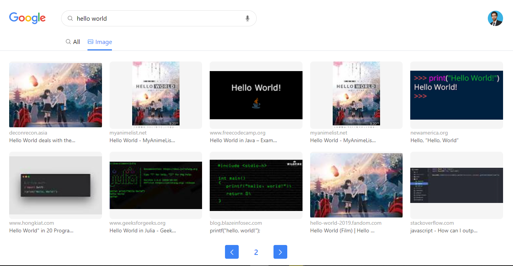

# Google Clone

Google clone app using Next.js. In this app you can search for real google data and images and you can SignIn with your Github account. I used Next-Auth to implement authentication.

---

I got the inspiration for this project from [Sahand Ghavidel](https://www.sahandghavidel.com/) course.